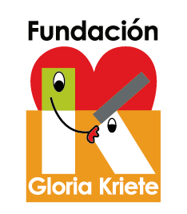

# Proyecta: Analysis & Growth

Proyecto desarrollado en el marco de **oportunidades de la Fundación Gloria Kriete**: aplicación web para visualizar **interés compuesto** y comparar supuestos de crecimiento.

**Qué hace:** a partir de capital inicial (V₀), tasa anual (r) y horizonte en años (t), calcula en paralelo escenarios **optimista (r + 5%)**, **realista (r)** y **pesimista (r − 5%, mín. 0%)**; muestra gráfico (exponencial vs. referencia lineal), KPIs (valor final, ROI, break-even), modo de estrés opcional y **tabla año a año**. Incluye la vista **`glosario.html`** con términos definidos en `js/glossary-data.js`. **Chart.js** va en `proyecta/vendor/` (sin CDN).

**Estructura del repo:**

- `proyecta/` — sitio estático (`index.html`, `glosario.html`, `css/`, `js/` incl. `glossary-data.js` y `glossary-page.js`, `vendor/`).
- Raíz — `package.json` solo para **regenerar** el bundle de Chart.js (opcional).

## Requisitos

| Para… | Necesitas |
|--------|-----------|
| Ver la app en local | Navegador reciente + **servidor local** (Node con `npx`, **o** [Visual Studio Code](https://code.visualstudio.com/) + extensión **Live Server**) |
| Regenerar Chart.js desde la raíz | `npm install` (opcional; ver más abajo) |

**Importante:** no abras `index.html` con doble clic (`file://…`). El gráfico y algunos recursos suelen fallar por la política de seguridad del navegador. Usa siempre una URL `http://localhost:…` o similar.

## Ejecutar en local

Sigue los pasos en orden. Elige **solo una** opción al final: **A (Node.js)** o **B (VS Code + Live Server)**.

1. **Obtén el proyecto** en tu equipo: clona el repo con Git o descarga el ZIP desde GitHub (**Code → Download ZIP**) y descomprime.
2. **Abre la carpeta correcta:** dentro del proyecto debe existir una carpeta llamada **`proyecta`** (minúsculas). Ahí están `index.html`, `css/`, `js/` y `vendor/`. Todo lo que sigue usa **esa** carpeta como raíz del sitio.
3. **Elige cómo vas a servir la carpeta `proyecta`:**

### Opción A — Node.js (`npx serve`)

1. Si no tienes Node.js, instálalo desde [nodejs.org](https://nodejs.org/) (versión **LTS**). Cierra y vuelve a abrir la terminal.
2. Comprueba la instalación: `node -v` (debe mostrar algo como `v20.x` o `v22.x`).
3. Abre una terminal **en la carpeta `proyecta`** (donde ves `index.html`).  
   - *Windows:* clic derecho en la carpeta → **Abrir en Terminal** / **Abrir en PowerShell aquí**.  
   - *Otro sitio:* `cd` hasta esa ruta, por ejemplo  
     `cd "C:\Users\TU_USUARIO\Documentos\Proyecta\proyecta"`.
4. Ejecuta:

   ```bash
   npx --yes serve .
   ```

5. Copia la URL que muestra la terminal (por ejemplo `http://localhost:3000`) y ábrela en el navegador.
6. Para detener el servidor: **Ctrl + C** en la terminal.

- **Puerto ocupado:** `npx --yes serve -l 5000 .` y abre `http://localhost:5000`.
- **Firewall (Windows):** si pide permiso para Node en red privada, puedes aceptarlo para `localhost`.

### Opción B — Sin Node.js: Visual Studio Code + Live Server

1. Instala [Visual Studio Code](https://code.visualstudio.com/) si aún no lo tienes.
2. Abre VS Code → **Extensiones** (icono de cuadrados o `Ctrl+Shift+X`) → busca **Live Server** (autor habitual: *Ritwick Dey*) → **Instalar**.
3. En VS Code: **Archivo → Abrir carpeta…** y selecciona la carpeta **`proyecta`** (la que contiene `index.html`), no la raíz del repo entero a menos que sepas qué estás haciendo.
4. En el explorador de archivos, **clic derecho en `index.html`** → **Open with Live Server**. (También puedes usar el botón **Go Live** en la barra de estado, si está visible.)
5. Se abrirá el navegador con una dirección `http://127.0.0.1:…` — ahí debe cargarse el simulador y el gráfico.
6. Para parar: en la barra de VS Code pulsa **Port: …** / **Stop Live Server** o el botón que indique la extensión.

### Si algo falla

1. **Página en blanco o errores en consola (F12):** la terminal o Live Server debe estar sirviendo la carpeta **`proyecta`**. No uses `file://` ni abras `index.html` desde una carpeta distinta.
2. **“node no se reconoce”:** instala Node LTS, cierra la terminal, abre una nueva y repite la opción A.
3. **Sin estilos al volver del glosario:** la URL del simulador debe terminar en **`…/proyecta/`** (con barra) o en **`…/proyecta/index.html`**, no en `…/proyecta` sin barra; si no, las rutas `css/…` se resuelven mal.
4. **Puerto en uso (Node):** usa otro con `npx --yes serve -l 5000 .`.

## Actualizar Chart.js (opcional, desde la raíz del repo)

```bash
npm install
```

Copia el archivo:

`node_modules/chart.js/dist/chart.umd.js` → `proyecta/vendor/chart.umd.js` (sustituyendo el existente).

---

## Sponsor

<div align="center">

<table>
  <tr>
    <td align="center" valign="middle">
      
    </td>
    <td align="center" valign="middle">
      
    </td>
  </tr>
</table>

</div>

*Con el apoyo de la **Fundación Gloria Kriete** y de la **Universidad Católica de El Salvador (UNICAES)**.*
